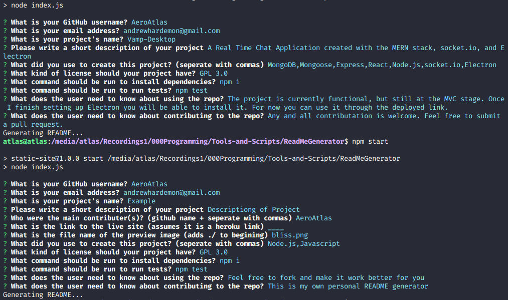

# ReadMe Generator


## Description

A terminal application for generating READMEs

## Contributors

[AeroAtlas](https://github.com/AeroAtlas/)

## Technologies

<ul>
  <li>Node.js</li>
  <li>Javascript</li>
</ul>

## Preview of Project

</img>

## Table of Contents 

* [Installation](#installation)

* [Usage](#usage)

* [License](#license)

* [Contributing](#contributing)

* [Tests](#tests)

* [Questions](#questions)

## Installation

To install necessary dependencies, run the following command:

```
npm i
```

## Usage

If you want to use this project just git clone the repository and run it locally

## License

This project is licensed under the GPL_3.0 license.
  
## Contributing

This is a personal utility project, but feel free to form or submit pull requests

## Tests

To run tests, run the following command:

```
npm test
```

## Questions

If you have any questions about the repo, open an issue or contact me directly at andrewhardemon@gmail.com. You can find more of my work at [AeroAtlas](https://github.com/AeroAtlas/).

